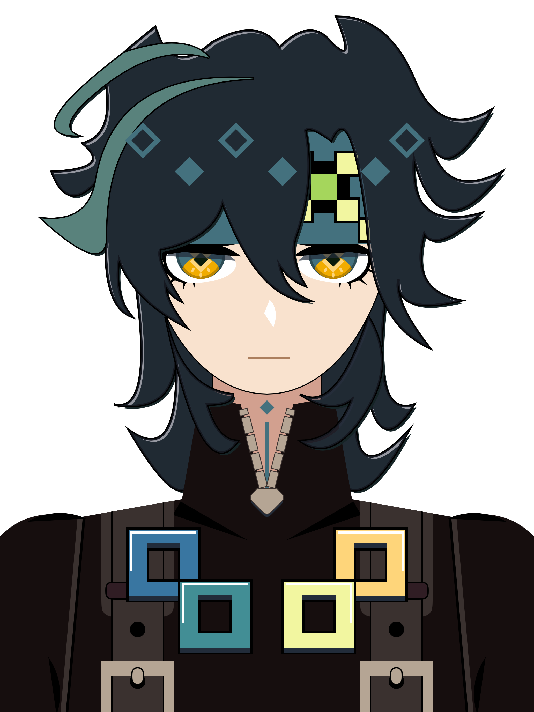

# ShapeArt - 基尼奇 (Kinich) SwiftUI 純代碼角色繪圖

<p align="center">
  
</p>

本專案使用純 **SwiftUI** 代碼繪製《原神》（Genshin Impact）納塔角色 —— **「回火之狩」基尼奇（Kinich）** 的半身肖像插畫。不依賴外部圖片資源，完全透過 SwiftUI 的基礎幾何圖形、遮罩裁切、以及向量路徑（`Path`）勾勒而成。

---

## 🎨 創作歷程與繪製思路

### 1. 先建結構：由下而上的幾何拼裝
剛開始畫的時候，策略是「先易後難」：
- **脖子、上衣與背帶系統**：衣服主體、領口、拉鍊小五金、背帶扣環與胸前幾何徽章結構相對規整，主要使用 SwiftUI 內建的簡單圖形組合：
  - `Rectangle`、`RoundedRectangle`、`UnevenRoundedRectangle` 構建服裝領口與拉鍊排列。
  - `Capsule`、`Circle` 表現肩膀弧線與背帶打孔金屬環。
  - 善用 `.scaleEffect(x: -1, y: 1)` 快速鏡像對稱零件（例如手臂、雙側衣領、眼睛）。
- **五官與像素頭帶**：
  - 頭帶底色與納塔標誌性的綠/黃/黑像素方格裝飾。
  - 雙眼則透過多層 `Ellipse`、`Circle` 裁切加上 `.trim()`，刻畫出眼影、虹膜深淺層次與睫毛。

---

### 2. 遭遇瓶頸：大魔王「狂野髮型」與求助 AI
畫到頭髮時遇到了最大的障礙：
- 基尼奇的髮型具有多層向外炸開的尖刺、兩側外翹的羽狀髮束、頭頂大呆毛，以及耳下垂掛的挑染長髮。
- 這類不規則且充滿張力的動漫髮型，**完全無法單純靠圓形或矩形拼湊出來**。
- 因此轉向請 AI 指導，學習如何運用 SwiftUI 的 **`Path`（向量路徑）** 與 **貝茲曲線（`addQuadCurve` / `addCurve`）**，透過設定起點、控制點與端點來精準拉出每一綹頭髮的流暢弧度與銳利尖端。

---

## 💡 踩坑心得：走過的彎路與頓悟

> **「堆了一堆 curve 形狀，描邊時才發現浪費了好多時間，直接畫邊就好！」**

在這次純代碼繪圖的過程中，最有感觸的體會：

1. **初期嘗試「曲線堆砌」的痛點**：
   - 在還沒全面換用 `Path` 前，中間有一大段過程試圖用一堆 `Ellipse().trim(...)`、旋轉角度以及相互疊加的 `.mask()` 硬去「湊」出曲線弧度。
   - 結果代碼裡充斥著無數微調的 `offset` 與旋轉角度，圖形之間牽一髮而動全身，層次非常脆弱。

2. **描邊（Stroke）時的當頭棒喝**：
   - 當準備給髮束和裝飾加上黑色輪廓邊線（`.stroke()`）時才發現悲劇 —— 那些靠重疊拼湊出來的零散圖形，邊線會全部暴露出來，交界處斷裂且完全無法收乾淨！
   - 這時才深刻意識到：**前面花那麼多時間堆砌零散曲線根本是繞了一大圈彎路**。
   - 最正確、最省時的方法，其實是直接用 **`Path` 一筆畫出閉合的輪廓**，既可以直接 `.fill()` 上色，又能一口氣加上完美的 `.stroke()` 邊線，乾淨俐落又好維護。

---

## 🛠️ 技術實作與 SwiftUI 特性

- **基礎形狀運用**：`Rectangle`、`Circle`、`Ellipse`、`Capsule`、`UnevenRoundedRectangle`
- **幾何形狀變換**：
  - `.trim(from:to:)` 截取圓弧與局部邊框
  - `.mask { ... }` 局部裁切出高光與特殊弧面
  - `.rotationEffect(...)` 與 `.offset(x:y:)` 精確空間定位
  - `.scaleEffect(x: -1, y: 1)` 達成精準對稱
- **向量路徑（Path & Shape）**：
  - 實作自訂 `Shape` 協議 (`func path(in rect: CGRect) -> Path`)
  - 使用二階貝茲曲線（`addQuadCurve(to:control:)`）與三階貝茲曲線（`addCurve(to:control1:control2:)`）
- **色彩管理**：
  - 專案 Assets 集中管理角色專屬色票（`Assets.xcassets`）
  - 使用 `LinearGradient` 製作挑染垂髮與吊墜光澤

---

## 📂 圖層架構（Layer Hierarchy）

在 `ContentView` 中，透過 `ZStack` 由底至頂分層渲染：

```swift
ZStack {
    HairView()          // 後髮層（後腦勺外擴髮簇、深色陰影底層、髮尾反光）
    ClothesBaseView()   // 上衣基底
    NeckView()          // 頸部
    FaceView()          // 臉部輪廓
    EyesView()          // 雙眼（左側）
    EyesView().scaleEffect(x: -1, y: 1) // 雙眼（右側鏡像）
    HeadbandView()      // 額前頭帶與像素方塊裝飾
    NoseView()          // 鼻樑與鼻尖微光
    NeckTieView()       // 頸飾條
    CollarView()        // 衣服立領
    ZipperView()        // 逐對排列的拉鍊金屬齒與拉頭
    ArmsView()          // 手臂衣袖
    CollarShadowView()  // 領口立體陰影
    BeltView()          // 雙肩背帶、打孔金屬環與固定扣
    BadgesView()        // 胸前幾何色彩圖騰徽章
    SleevesView()       // 袖線與肩膀輪廓
    HairStrandView()    // 前髮層（額前瀏海、鬢角、頭頂呆毛與吊墜耳飾）
}
```

---

## 💻 執行環境

- **平台**：iOS / iPadOS
- **開發工具**：Xcode 16+ / SwiftUI 6.0+
- **預覽方式**：在 Xcode 開啟專案後，打開 `ContentView.swift` 即可透過 Canvas 即時預覽畫面。
